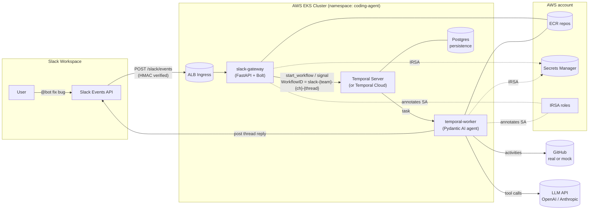
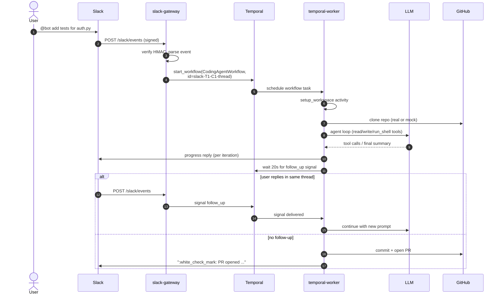

# Architecture

## High-level flow

## Per-request lifecycle

## Session isolation

The system isolates concurrent users via three independent boundaries:

| Boundary | Mechanism |
| --- | --- |
| **Per-thread workflow** | `workflow_id_for_thread()` derives a deterministic, unique Workflow ID from `(team_id, channel_id, thread_ts)`. Two Slack threads can never share workflow state. |
| **Per-workflow workspace** | Every workflow gets its own filesystem subtree under `AGENT_WORKSPACE_ROOT`. The `Workspace.resolve()` helper rejects path traversal so the agent's `read_file` / `write_file` tools can't escape. |
| **Per-pod IAM** | Each service has its own IRSA role with the *minimum* set of `secretsmanager:GetSecretValue` permissions. The gateway role can only read Slack tokens; the worker role only its own secrets. |

## Why Temporal

The agent loop is a long-running, multi-step process that benefits from:

* **Durability** - if a worker pod dies mid-run, Temporal replays the workflow on another pod up to the last successful activity.
* **Observability** - each activity (clone, agent run, commit, PR, slack reply) is a discrete step in the Temporal UI.
* **Retries** - transient failures (Slack rate limits, GitHub 5xx) retry with backoff without us writing a state machine.
* **Signals** - follow-up Slack messages on the same thread are delivered to the running workflow, enabling multi-turn conversations.

## Component map

| Component | Path | Purpose |
| --- | --- | --- |
| Shared types | `packages/shared/` | Pydantic models on the workflow contract. |
| Slack gateway | `apps/slack_gateway/` | FastAPI + Bolt, starts/signals workflows. |
| Temporal worker | `apps/temporal_worker/` | Hosts the agent + activities. |
| Pydantic AI agent | `apps/temporal_worker/src/temporal_worker/agent/` | LLM tool loop, system prompt, output schema. |
| GitHub integration | `apps/temporal_worker/src/temporal_worker/github_integration/` | `Protocol` + real and mock implementations. |
| Helm charts | `helm/` | Two service charts + an umbrella that pulls in the upstream Temporal chart. |
| Terraform | `terraform/envs/dev/` | VPC, EKS, ECR, Secrets Manager, IRSA. |
